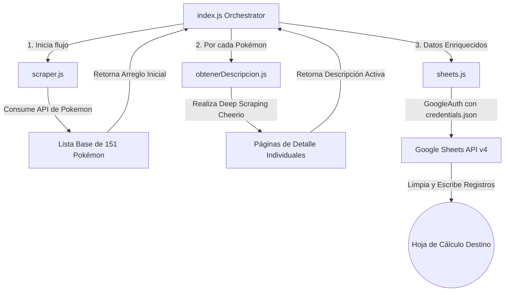

# 📌 PokéScraper Sheets 🚀
> **Automatización Industrial de Extracción de Datos de Pokémon y Sincronización en Tiempo Real con Google Sheets**

[](https://nodejs.org/)
[](https://www.docker.com/)
[](https://developers.google.com/sheets/api)
[](https://opensource.org/licenses/ISC)

---

## 📖 Descripción Clara

**PokéScraper Sheets** es una solución robusta y automatizada de extracción y estructuración de datos (*Web Scraping* e integración API) escrita en **Node.js**. El sistema consume la API oficial de Pokémon para obtener el listado base de la primera generación (151 Pokémon), realiza un *deep scraping* concurrente sobre la página de detalles de cada criatura para extraer su descripción oficial activa, y finalmente centraliza, limpia y escribe la información estructurada directamente en una hoja de cálculo de **Google Sheets** a través de la API oficial de Google Workspace (v4).

---

## ⚡ El Problema que Resuelve

Para desarrolladores, analistas de datos y creadores de contenido del ecosistema Pokémon, recopilar información detallada y actualizada (nombres, tipos, imágenes y descripciones oficiales en español) suele implicar un trabajo manual propenso a errores y sumamente tardado. Las APIs públicas a menudo carecen de descripciones traducidas o imágenes en alta resolución agrupadas de manera eficiente.

**PokéScraper Sheets** resuelve esto al proporcionar:
1. **Consolidación en un solo paso**: Ejecuta el pipeline completo de extracción, enriquecimiento y carga de datos en segundos.
2. **Acceso Colaborativo Inmediato**: Al persistir los datos en Google Sheets, cualquier miembro de un equipo técnico o no-técnico puede consumir y visualizar la información de forma inmediata.
3. **Estructura Confiable**: Elimina la inconsistencia en los datos formateando automáticamente cada registro.

---

## 🛠️ Tecnologías Utilizadas

El core del proyecto está diseñado bajo una arquitectura ligera de alto rendimiento con dependencias cuidadosamente seleccionadas:

*   **Entorno de Ejecución**: [Node.js (v18+)](https://nodejs.org/) - Motor asíncrono optimizado para operaciones I/O intensivas.
*   **Web Scraping & parsing HTML**: [Cheerio](https://cheerio.js.org/) - Parser ultra-rápido que implementa un subconjunto del core de jQuery para manipular el DOM del servidor.
*   **Cliente HTTP**: [Axios](https://axios-http.com/) - Cliente basado en promesas para consumir endpoints y descargar recursos HTML.
*   **Google Workspace Integración**: [Googleapis (v171)](https://www.npmjs.com/package/googleapis) - SDK oficial para interactuar de forma segura con la API de Google Sheets mediante cuentas de servicio.
*   **Configuración y Seguridad**: [Dotenv](https://github.com/motdotla/dotenv) - Carga de variables de entorno para proteger identificadores sensibles.
*   **Contenedores**: [Docker](https://www.docker.com/) & [Docker Compose](https://docs.docker.com/compose/) - Garantizan la portabilidad y consistencia del entorno en cualquier máquina host.

---

## 📐 Arquitectura del Sistema

El flujo de ejecución del scraper sigue un diseño modular y desacoplado:



### Componentes Core:
1.  **`src/index.js` (Orquestador)**: Administra el flujo de control, iterando sobre la lista base para enriquecerla y disparar la escritura en lote.
2.  **`src/scraper.js` (Extractor Base)**: Consume el catálogo inicial a través de peticiones directas y mapea los datos esenciales (`numero`, `nombre`, `tipos`, `imagen` y `detailURL`).
3.  **`src/obtenerDescripcion.js` (Scraper Detallado)**: Visita dinámicamente cada URL detallada y utiliza selectores CSS refinados (`p.version-x.active`) para capturar la descripción correcta.
4.  **`src/sheets.js` (Cargador / Conector)**: Gestiona la autenticación Oauth/Service-Account, limpia el rango existente para evitar duplicaciones y realiza la inserción masiva.

---

## 📂 Estructura del Proyecto

La estructura sigue estándares profesionales de orden y modularidad:

```text
pokedex_scraping/
├── src/
│   ├── index.js                  # Punto de entrada y orquestador del flujo
│   ├── scraper.js                # Cliente API para obtener el listado base
│   ├── obtenerDescripcion.js     # Parser de HTML con Cheerio para descripciones
│   └── sheets.js                 # Manejador de integración con Google Sheets
├── .env                          # Variables de entorno críticas (Ignorado por Git)
├── .gitignore                    # Exclusiones de Git (Ignora credenciales y dependencias)
├── credentials.json              # Certificado de Google Service Account (Ignorado por Git)
├── Dockerfile                    # Configuración de Docker para despliegues portables
├── docker-compose.yml            # Orquestador local Docker Compose
├── package-lock.json             # Árbol exacto de dependencias de npm
└── package.json                  # Scripting del proyecto y dependencias de NPM
```

---

## 🔑 Configuración de Credenciales de Google

Para que el script pueda actualizar tu hoja de cálculo, debes configurar una cuenta de servicio de Google:

1.  Ve a la [Google Cloud Console](https://console.cloud.google.com/).
2.  Crea un nuevo proyecto o selecciona uno existente.
3.  Habilita la **Google Sheets API**.
4.  Ve a **Credenciales** -> **Crear Credenciales** -> **Cuenta de Servicio**.
5.  Una vez creada la cuenta, ingresa a ella, navega a la pestaña **Claves** -> **Agregar clave** -> **Crear clave nueva (JSON)**.
6.  Descarga el archivo generado, renombralo a `credentials.json` y colócalo en la raíz del proyecto.
7.  **Importante**: Abre tu hoja de cálculo de Google Sheets, copia el correo de la Cuenta de Servicio recién creada (ej. `mi-cuenta@proyecto.iam.gserviceaccount.com`) y **comparte la hoja con este correo** otorgándole permisos de **Editor**.

---

## 🚀 Guía de Instalación y Uso

### Opción A: Ejecución Local en Node.js

#### Requisitos Previos:
*   Node.js v18.0.0 o superior instalado.
*   npm instalado de forma global.

#### Pasos:

1.  **Clonar el repositorio**:
    ```bash
    git clone https://github.com/DearTitan70/Pokedex-Scraping.git
    cd pokedex_scraping
    ```

2.  **Instalar dependencias**:
    ```bash
    npm install
    ```

3.  **Configurar variables de entorno**:
    Crea un archivo `.env` en la raíz del proyecto agregando el ID de tu Google Spreadsheet:
    ```env
    SPREADSHEET_ID=tu_spreadsheet_id_aqui
    ```
    *(Nota: El ID de la hoja se encuentra en la URL de tu navegador: `https://docs.google.com/spreadsheets/d/TU_SPREADSHEET_ID/edit`)*

4.  **Asegurar archivo de credenciales**:
    Confirma que tu archivo `credentials.json` descargado esté en la raíz del proyecto.

5.  **Ejecutar el script**:
    ```bash
    npm start
    ```

---

### Opción B: Configuración con Docker (Recomendado)

Evita instalar Node.js localmente y ejecuta el pipeline de forma completamente aislada e idéntica a producción.

#### Requisitos Previos:
*   Docker instalado.
*   Docker Compose instalado.

#### Pasos:

1.  **Estructura preparada**: Asegúrate de tener los archivos `.env` y `credentials.json` en la raíz.
2.  **Construir y levantar el contenedor**:
    ```bash
    docker-compose up --build
    ```
    Este comando compilará la imagen optimizada (basada en Alpine Linux) y ejecutará el script completo de manera autónoma.

3.  **Comando Docker sin Docker Compose (Alternativa)**:
    Si prefieres usar la CLI de Docker estándar:
    ```bash
    docker build -t pokedex-scraper .
    docker run --rm --env-file .env -v "$(pwd)/credentials.json:/usr/src/app/credentials.json" pokedex-scraper
    ```

---

## ✨ Features (Características Clave)

*   **Scraping Híbrido**: Combina consumos ultrarrápidos de API estructurada y parseo HTML preciso del DOM de páginas secundarias.
*   **Prevención de Errores SSL (Legacy Agent)**: Incorpora agentes HTTPS flexibles con bypass controlado para entornos corporativos o proxies con certificados autofirmados.
*   **Limpieza de Rangos (Sobrescritura Atómica)**: Borra por completo el contenido previo en la hoja `Pokemons` antes de escribir los datos nuevos, garantizando que si el listado cambia de tamaño, no queden datos residuales.
*   **Consistencia de Datos**: Formatea de manera homogénea elementos como los tipos de Pokémon capitalizando cada entrada (ej. "Fuego/Volador").
*   **Despliegue Portable**: Archivos Docker listos para entornos CI/CD o tareas programadas cron en la nube.

---

## 🎯 Casos de Uso

*   **Poblamiento Inicial de Bases de Datos**: Ideal para sembrar tablas SQL o colecciones MongoDB con datos reales al desarrollar clones de Pokémon o juegos interactivos.
*   **Tableros de Análisis y Business Intelligence**: Conexión directa del Google Sheet con herramientas de visualización como Google Looker Studio, Tableau o PowerBI para analizar la distribución de tipos o ratios de imágenes.
*   **Portales de Contenido Automáticos**: Sincronizar catálogos o blogs web directamente leyendo los datos desde el Google Sheet expuesto como API REST.

---

## 🗺️ Roadmap de Próximas Funcionalidades

- [ ] **Soporte Multigeneracional**: Agregar un selector dinámico para extraer regiones adicionales (Johto, Hoenn, Sinnoh, etc.).
- [ ] **Descarga y Almacenamiento Local de Imágenes**: Implementar un descargador asíncrono para almacenar localmente las miniaturas de los Pokémon y no depender de URLs externas.
- [ ] **Paralelismo Controlado con Cola de Tareas**: Migrar el bucle `for` lineal a una cola con concurrencia controlada (ej. usando `p-limit` o similar) para procesar las descripciones 5x más rápido respetando límites de tasa (*rate limits*).
- [ ] **Programación Nativa**: Añadir un servicio cron persistente en Docker para realizar actualizaciones periódicas de forma desatendida.
